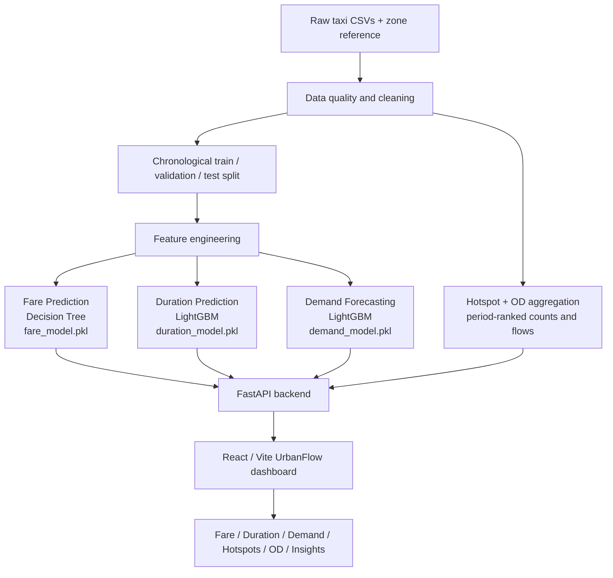

# UrbanFlow Implemented Architecture

```mermaid
flowchart TB
    raw[Raw taxi CSVs + zone reference] --> clean[Data quality and cleaning]
    clean --> split[Chronological train / validation / test split]
    split --> features[Feature engineering]
    features --> fare[Fare Prediction\nDecision Tree\nfare_model.pkl]
    features --> duration[Duration Prediction\nLightGBM\nduration_model.pkl]
    features --> demand[Demand Forecasting\nLightGBM\ndemand_model.pkl]
    clean --> spatial[Hotspot + OD aggregation\nperiod-ranked counts and flows]
    fare --> api[FastAPI backend]
    duration --> api
    demand --> api
    spatial --> api
    api --> dashboard[React / Vite UrbanFlow dashboard]
    dashboard --> outputs[Fare / Duration / Demand / Hotspots / OD / Insights]
```

The system uses the zone reference for authoritative IDs and names. No geographic coordinates or geometry are included because none exist in the project data.